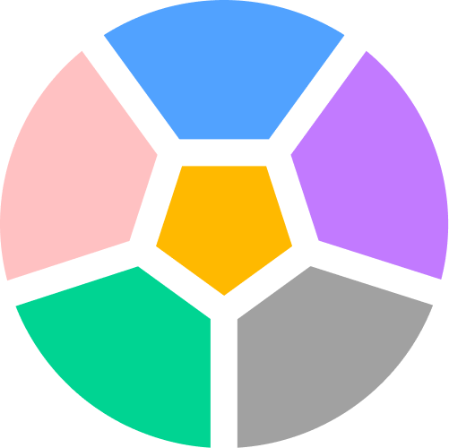
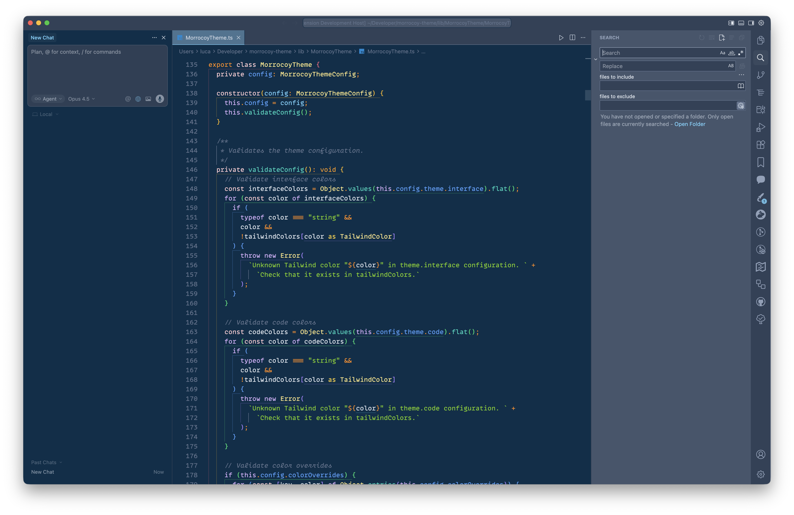

<p align="center">
  
</p>

<h1 align="center">Morrocoy Theme</h1>

<p align="center">
  <strong>🎨 A beautiful VS Code & Cursor theme built with Tailwind CSS colors</strong>
</p>

<p align="center">
  <a href="https://marketplace.visualstudio.com/items?itemName=your-publisher.morrocoy-theme">
    
  </a>
  <a href="https://marketplace.visualstudio.com/items?itemName=your-publisher.morrocoy-theme">
    
  </a>
  <a href="LICENSE">
    
  </a>
</p>

---

## Table of Contents

- [Table of Contents](#table-of-contents)
- [Themes](#themes)
  - [Morrocoy Dark](#morrocoy-dark)
- [Installation](#installation)
- [Building Themes with MorrocoyTheme](#building-themes-with-morrocoytheme)
  - [Why MorrocoyTheme?](#why-morrocoytheme)
  - [Quick Start](#quick-start)
  - [Theme Configuration](#theme-configuration)
    - [Interface Colors](#interface-colors)
    - [Code Colors](#code-colors)
  - [Full Example](#full-example)
  - [Overrides](#overrides)
- [Development](#development)
- [Deployment](#deployment)
  - [How It Works](#how-it-works)
  - [Required Secrets](#required-secrets)
  - [Setting Up Secrets](#setting-up-secrets)
  - [Triggering a Release](#triggering-a-release)
- [Contributing](#contributing)
- [License](#license)

---

## Themes

### Morrocoy Dark

A dark theme with a soothing blue-gray palette, perfect for long coding sessions.

<p align="center">
  
</p>

---

## Installation

1. Open **VS Code** or **Cursor**
2. Go to Extensions (`Ctrl+Shift+X` / `Cmd+Shift+X`)
3. Search for `Morrocoy Theme`
4. Click **Install**
5. Open Command Palette (`Ctrl+Shift+P` / `Cmd+Shift+P`)
6. Type `Preferences: Color Theme` and select **Morrocoy Dark**

---

## Building Themes with MorrocoyTheme

The `MorrocoyTheme` class is the heart of this project. It lets you build beautiful VS Code themes using **Tailwind CSS colors** without manually setting hundreds of individual color values.

### Why MorrocoyTheme?

Creating a VS Code theme from scratch is overwhelming—there are **550+ color keys** for the interface alone, plus syntax highlighting tokens. The `MorrocoyTheme` class solves this by:

- ✅ **Using Tailwind colors** — Familiar, consistent color palette with autocomplete
- ✅ **Semantic color mapping** — Define ~25 meaningful colors, and the class generates all 550+ values
- ✅ **Type-safe** — Full TypeScript support with autocomplete for color names
- ✅ **Easy to customize** — Override any specific color when needed
- ✅ **Generates JSON** — Outputs the standard VS Code theme JSON format

### Quick Start

```typescript
import { MorrocoyTheme } from 'lib/MorrocoyTheme';

const myTheme = new MorrocoyTheme({
  name: 'My Custom Theme',
  fileName: 'my-theme.json',
  type: 'dark', // or "light"

  theme: {
    interface: {
      // Define your workbench colors here
      foreground: 'slate.200',
      backgroundEditor: 'slate.900',
      accent: 'sky.400',
      // ... more interface colors
    },
    code: {
      // Define your syntax highlighting colors here
      foreground: 'slate.200',
      keyword: 'purple.400',
      string: 'green.400',
      function: 'blue.400',
      // ... more code colors
    },
  },
});

// Generate the VS Code theme JSON
const themeJSON = myTheme.toJSON();
```

### Theme Configuration

The theme configuration is split into two main sections:

#### Interface Colors

These control the **VS Code workbench** appearance (editor, sidebar, tabs, etc.):

| Property                | Description                         | Example                          |
| ----------------------- | ----------------------------------- | -------------------------------- |
| `foreground`            | Primary text color                  | `"slate.200"`                    |
| `textSecondary`         | Secondary/less prominent text       | `"slate.400"`                    |
| `textMuted`             | Muted text (placeholders, hints)    | `"slate.500"`                    |
| `textInactive`          | Inactive elements                   | `"slate.600"`                    |
| `backgroundEditor`      | Main editor background              | `"slate.900"`                    |
| `backgroundSidebar`     | Sidebar background                  | `"slate.800"`                    |
| `backgroundActivityBar` | Activity bar background             | `"slate.850"`                    |
| `backgroundWidget`      | Dropdowns, inputs, popups           | `"slate.800"`                    |
| `border`                | Primary borders                     | `"slate.700"`                    |
| `borderSubtle`          | Subtle borders                      | `"slate.600"`                    |
| `accent`                | Accent color (focus, badges, links) | `"sky.400"`                      |
| `error`                 | Error indicators                    | `"red.400"`                      |
| `warning`               | Warning indicators                  | `"orange.400"`                   |
| `success`               | Success indicators                  | `"green.500"`                    |
| `info`                  | Info indicators                     | `"blue.500"`                     |
| `cursor`                | Cursor color                        | `"slate.200"`                    |
| `bracketColors`         | Rainbow bracket colors (array of 6) | `["rose.400", "amber.400", ...]` |

#### Code Colors

These control **syntax highlighting**:

| Property      | Description                         | Example        |
| ------------- | ----------------------------------- | -------------- |
| `foreground`  | Default code text                   | `"slate.200"`  |
| `comment`     | Comments                            | `"slate.500"`  |
| `commentDoc`  | Doc comment keywords                | `"slate.400"`  |
| `string`      | String literals                     | `"lime.500"`   |
| `number`      | Numeric literals                    | `"amber.400"`  |
| `punctuation` | Operators, brackets                 | `"orange.400"` |
| `keyword`     | Keywords                            | `"purple.300"` |
| `controlFlow` | Control flow (return, if, await)    | `"rose.400"`   |
| `storage`     | Declarations (const, let, function) | `"rose.200"`   |
| `import`      | Import/export statements            | `"orange.400"` |
| `type`        | Types, classes, interfaces          | `"amber.200"`  |
| `function`    | Function names                      | `"teal.400"`   |
| `parameter`   | Function parameters                 | `"sky.300"`    |
| `property`    | Object properties                   | `"blue.400"`   |
| `tag`         | HTML/XML tags                       | `"rose.400"`   |
| `attribute`   | HTML attributes                     | `"purple.300"` |

### Full Example

Here's the complete configuration for **Morrocoy Dark**:

```typescript
import { MorrocoyTheme, MorrocoyThemeConfig } from 'lib/MorrocoyTheme';

const config: MorrocoyThemeConfig = {
  name: 'Morrocoy Dark',
  fileName: 'morrocoy-dark.json',
  type: 'dark',
  semanticHighlighting: true,

  theme: {
    interface: {
      // Text
      foreground: 'slate.300',
      textSecondary: 'slate.200',
      textMuted: 'slate.500',
      textInactive: 'slate.400',

      // Backgrounds
      backgroundEditor: 'sky.950',
      backgroundSidebar: 'slate.600',
      backgroundActivityBar: 'slate.700',
      backgroundWidget: 'slate.700',
      backgroundHover: 'slate.600',

      // Borders
      border: 'slate.500',
      borderSubtle: 'slate.500',

      // Semantic
      accent: 'sky.300',
      error: 'red.400',
      warning: 'orange.400',
      success: 'green.500',
      info: 'blue.500',
      hints: 'violet.400',
      modified: 'amber.400',

      // Cursor & Selection
      cursor: 'slate.300',
      selection: 'blue.500',
      findMatchBorder: 'amber.400',

      // Bracket colors
      bracketColors: ['rose.400', 'amber.400', 'green.400', 'blue.400', 'violet.400', 'cyan.400'],
    },

    code: {
      foreground: 'slate.200',
      comment: 'slate.500',
      commentDoc: 'slate.400',
      string: 'lime.500',
      number: 'amber.400',
      punctuation: 'orange.400',
      keyword: 'purple.300',
      controlFlow: 'rose.400',
      storage: 'rose.200',
      import: 'orange.400',
      type: 'amber.200',
      modifier: 'amber.300',
      primitive: 'amber.500',
      function: 'teal.400',
      parameter: 'sky.300',
      property: 'blue.400',
      attribute: 'purple.300',
      tag: 'rose.400',
      tagPunctuation: 'teal.400',
      invalid: 'rose.500',
      embedded: 'purple.300',
      link: 'purple.300',
    },
  },
};

export const morrocoyDarkTheme = new MorrocoyTheme(config);
```

### Overrides

Need to tweak a specific VS Code color? Use `colorOverrides`:

```typescript
const config: MorrocoyThemeConfig = {
  // ... theme config

  colorOverrides: {
    // Override specific VS Code color keys
    'editor.lineHighlightBackground': 'slate.800',
    'tab.activeBorder': 'sky.500',
  },

  // Override semantic token colors
  semanticTokenColors: {
    operator: 'orange.400',
    interface: 'amber.200',
  },
};
```

---

## Development

```bash
# Install dependencies
pnpm install

# Build themes (generates JSON files in /themes)
pnpm run build:themes

# Run tests
pnpm test

# Package extension
pnpm run package
```

---

## Deployment

This repository includes a GitHub Actions workflow for **automatic deployment** to both the [VS Code Marketplace](https://marketplace.visualstudio.com/) and [Open VSX Registry](https://open-vsx.org/) (used by Cursor, VSCodium, and other VS Code forks).

### How It Works

The release workflow (`.github/workflows/release.yml`) uses [auto](https://github.com/intuit/auto) with the `@auto-it/vscode` plugin to:

1. **Automatically version** your extension based on PR labels (`major`, `minor`, `patch`)
2. **Generate changelogs** from PR titles and descriptions
3. **Create GitHub releases** with proper tags
4. **Publish to VS Code Marketplace** via `vsce`
5. **Publish to Open VSX Registry** via `ovsx` (optional)

The workflow triggers automatically on every push to `main`.

### Required Secrets

Set these secrets in your GitHub repository (**Settings → Secrets and variables → Actions**):

| Secret     | Required    | Description                                                                                                    |
| ---------- | ----------- | -------------------------------------------------------------------------------------------------------------- |
| `GH_TOKEN` | ✅ Yes      | GitHub Personal Access Token with `repo` scope. Used by `auto` to create releases, tags, and update changelog. |
| `VSCE_PAT` | ✅ Yes      | VS Code Marketplace Personal Access Token. Used by the `@auto-it/vscode` plugin to publish to the marketplace. |
| `OVSX_PAT` | ❌ Optional | Open VSX Personal Access Token. If not set, Open VSX publishing is skipped.                                    |

### Setting Up Secrets

#### 1. GitHub Token (`GH_TOKEN`)

1. Go to [GitHub → Settings → Developer settings → Personal access tokens → Tokens (classic)](https://github.com/settings/tokens)
2. Click **Generate new token (classic)**
3. Select scopes: `repo` (full control of private repositories)
4. Copy the token and add it as `GH_TOKEN` in your repo secrets

#### 2. VS Code Marketplace Token (`VSCE_PAT`)

1. Go to [Azure DevOps](https://dev.azure.com/) and sign in with your Microsoft account
2. Create an organization if you don't have one
3. Click your profile icon → **Personal access tokens**
4. Click **New Token**:
   - Name: `vsce-publish` (or any name)
   - Organization: **All accessible organizations**
   - Scopes: **Custom defined** → **Marketplace** → check **Manage**
5. Copy the token and add it as `VSCE_PAT` in your repo secrets

> **Note:** Make sure the `publisher` field in `package.json` matches your VS Code Marketplace publisher ID.

#### 3. Open VSX Token (`OVSX_PAT`) — Optional

1. Go to [Open VSX Registry](https://open-vsx.org/)
2. Sign in with GitHub
3. Go to your profile → **Access Tokens**
4. Create a new token
5. Copy the token and add it as `OVSX_PAT` in your repo secrets

### Triggering a Release

1. **Create a PR** with your changes
2. **Add a label** to the PR to control versioning:
   - `patch` — Bug fixes (0.0.x)
   - `minor` — New features (0.x.0)
   - `major` — Breaking changes (x.0.0)
3. **Merge the PR** — The workflow will automatically:
   - Bump the version
   - Update `CHANGELOG.md`
   - Create a GitHub release
   - Publish to VS Code Marketplace
   - Publish to Open VSX (if `OVSX_PAT` is set)

You can skip CI for a commit by including `ci skip` or `skip ci` in the commit message.

---

## Contributing

Contributions are welcome! Feel free to:

- 🐛 Report bugs
- 💡 Suggest new theme variants
- 🎨 Submit your own themes built with `MorrocoyTheme`
- 📖 Improve documentation

---

## License

[MIT](LICENSE) © Morrocoy Theme Contributors
